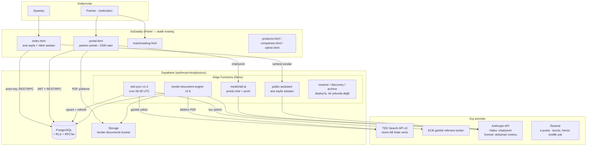

# MedicHall — Sistem Mimarisi

*Son güncelleme: 19 Temmuz 2026 · Bu doküman CANLI sistemi anlatır — plan
veya hedef mimari değil. Her bileşen deploy edilmiş durumdadır; istisnalar
açıkça işaretlenmiştir.*

---

## 1. Genel bakış

MedicHall, medikal sektör için AI destekli B2B platformudur
("The AI marketplace for medical manufacturers"). Üç ürün ayağı:

1. **Tender Intelligence** — AB medikal ihalelerini her sabah çeker, firmaya
   göre skorlar, AI dokümanı okuyup kanıtlı analiz üretir.
2. **Business Matchmaking** — üretici ↔ distribütör ↔ alıcı iki taraflı
   eşleştirme.
3. **Dijital pazaryeri** — showroom, ürün kataloğu, RFQ, mesajlaşma.

### Tasarım felsefesi (mimariyi şekillendiren kararlar)

| İlke | Mimari sonucu |
|---|---|
| **Sahte veri asla yok** | Sayaçlar gerçek DB verisi; veri yoksa UI bileşeni hiç görünmez. Kur çevirisi yalnız resmi ECB kurlarıyla, "≈" işaretli ve orijinal değer korunarak. |
| **AI uydurmaz, kanıt gösterir** | Doküman motoru her çıkarımı sayfa numaralı alıntıyla döndürür; kanıt alıntıları çeviri açıkken bile orijinal dilde kalır. |
| **Skorlama ≠ filtre** | Eşleştirme motoru ihaleleri elemez, puanlar. Keşif için ayrı "All tenders" modu vardır. Değer filtresi bile varsayılan olarak değeri belirtilmemiş ihaleleri gösterir. |
| **robots.txt'ye saygı** | Ulusal ihale portalları kazınmaz (eAppalti FVG canlı testle doğrulandı). Çözüm BYOD: kullanıcı dokümanı indirir ve yükler, motor okur. Hukuki risk sıfır. |
| **Build zinciri yok** | Frontend saf statik HTML/CSS/JS. Kod bilmeyen kurucu tek başına cPanel'den deploy edebilir. Bilinçli bir ödünleşim: framework konforu yerine operasyonel bağımsızlık. |

---

## 2. Mimari diyagram



---

## 3. Bileşenler

### 3.1 Frontend — statik HTML (GoDaddy cPanel)

Tek sayfalık uygulama yok, framework yok, build adımı yok. Her sayfa kendi
CSS/JS'ini gömülü taşır. Deploy = cPanel File Manager'a dosya yükleme +
tarayıcıda Ctrl+F5 (agresif önbellek).

| Sayfa | Rol |
|---|---|
| `index.html` | Ana sayfa. Canlı ölçek bandı (`medichall_public_stats()` RPC — veri yoksa bant görünmez), animasyonlu matchmaking akışı, featured products rayı, hibrit asistan (kalıp sorular kurallı ve bedava; serbest sorular `public-assistant`'a). |
| `portal.html` | En büyük dosya. Sekmeler: Dashboard, Company profile, My products, RFQ inbox, Opportunities, AI Assistant. Opportunities iki modlu: **My matches** (profil-skorlu) ve **All tenders** (tüm besleme + gelişmiş filtreler: CPV ailesi, deadline, notice type, EUR değer aralığı). Derin analiz ekranı: Opportunity Score, AI özet, tıklanabilir lot kartları, kanıt alıntılı ürün tablosu, isteğe bağlı İngilizce çeviri, BYOD doküman yükleme. |
| `matchmaking.html` | İki taraflı eşleştirme MVP. Portal profilinden otomatik ön-doldurma. |
| `products.html`, `companies.html` | Katalog ve firma vitrinleri (DB'den canlı). |
| `admin.html` | İç yönetim. |

**Tasarım dili:** Inter fontu, SVG çizgi ikonlar (emoji yok), minimum
gradient, 8px köşe, WCAG AA kontrast. Referans seviye: MedicalExpo.
(`index.html`'de tam uygulanmış; portal ve matchmaking'e taşınması backlog'da.)

**Oturum:** `mh_p_token` + `mh_p_refresh` (localStorage). 401'de otomatik
token yenileme portala gömülü.

### 3.2 Backend — Supabase

Tek Supabase projesi: PostgreSQL + Edge Functions (Deno) + Storage. Sunucu
yönetimi yok. Frontend, PostgREST üzerinden doğrudan DB'ye ve RPC'lere
konuşur; ağır/gizli işler Edge Function'larda.

### 3.3 Edge Functions

| Fonksiyon | İş | Verify JWT | Tetik |
|---|---|---|---|
| `ted-sync` **v1.4** | TED'den günlük çekim (varsayılan tüm AB, `TED_COUNTRIES` ile daraltılabilir) → `tenders` upsert → süresi geçenleri kapat → ECB kurlarını `fx_rates`'e yaz → EUR karşılıklarını tazele → tüm profiller için eşleşme yenile. Elle tetikte body override: `{"lookback_days":30,"max_pages":10}`. | **KAPALI** (`x-cron-secret`) | pg_cron 06:30 UTC |
| `tender-document-engine` **v2.6** | Derin analiz. Kayıtlı doküman varsa onları, yoksa resmi TED bildirim PDF'i + Search API verisi. Çıktı: products(+kanıt), lots(+catalog_fit_score), summary, fit_narrative, missing_information. Zırh: 16k token, 30 lot sınırı, kesilmede otomatik 2. deneme, toleranslı JSON ayıklama. | AÇIK | Portal (derin analiz butonu) |
| `medichall-ai` | Portal chat + çeviri (Haiku). Günlük limit, `medichall_ai_usage` log. | AÇIK | Portal |
| `public-assistant` | Ana sayfa asistanının Claude ayağı. IP başına 30 dk'da 6 soru, 500 karakter girdi sınırı, konu bekçisi, CORS yalnız medichall.com. | **KAPALI** | index.html |
| `ted-notice-resolver`, `tender-attachment-discovery`, `tender-archive-worker` | Doküman keşif/arşiv altyapısı. Deploy'lu ama tık yolundan çıkarıldı — derin analiz motor-öncelikli 2 adım (~30-60 sn). | AÇIK | (pasif) |

> ⚠️ **En sık kurulum hatası:** Verify JWT ayarının tabloya uymaması.
> `ted-sync` ve `public-assistant` KAPALI, diğerleri AÇIK olmalı.

**Secrets:** `ANTHROPIC_API_KEY`, `CRON_SECRET`; opsiyonel: `ANTHROPIC_MODEL`,
`DOC_ENGINE_MODEL`, `TED_COUNTRIES`, `TED_LOOKBACK_DAYS`, `TED_MAX_PAGES`,
`TED_CPV`, `PUBLIC_AI_MODEL/IP_LIMIT/WINDOW_MIN`.

**Model seçimi:** chat/çeviri/asistan → `claude-haiku-4-5` (ucuz, hızlı);
doküman motoru → `claude-sonnet-4-6` (`DOC_ENGINE_MODEL` → `ANTHROPIC_MODEL`
→ varsayılan zinciri).

### 3.4 Dış servisler

| Servis | Kullanım | Not |
|---|---|---|
| TED Search API v3 | Resmi AB ihale verisi | Anahtar gerektirmez. Bildirim sayfaları JS uygulamasıdır — HTML kazınmaz; veri Search API'den veya resmi bildirim PDF'inden (`ted.europa.eu/en/notice/{pub}/pdf`) alınır. |
| ECB referans kurları | EUR karşılıkları | Resmi, günlük, ücretsiz. Kur yoksa çeviri yapılmaz. |
| Anthropic API | Tüm AI özellikleri | İki model kademesi (yukarıda). |
| Resend | E-posta | Kurulu; digest/bildirim özelliği Sprint C'de. |

---

## 4. Depo yapısı

```
medichall/  (branch: develop)
├── index.html                  # Ana sayfa
├── portal.html                 # Partner portalı
├── matchmaking.html
├── products.html
├── companies.html
├── admin.html
├── docs/                       # Mimari, kurulum ve özellik dokümanları
│   ├── ARCHITECTURE.md         #   (bu dosya)
│   ├── MEDICHALL-DEVIR-TESLIM.md
│   ├── SPRINT-A-KURULUM.md / SPRINT-B-KURULUM.md
│   └── MATCH_ENGINE_*.md, TENDER_*.md ...
└── supabase/
    ├── functions/              # Edge Function'lar (her klasörde index.ts)
    │   ├── ted-sync/
    │   ├── tender-document-engine/
    │   ├── medichall-ai/
    │   ├── public-assistant/
    │   ├── ted-notice-resolver/
    │   ├── tender-attachment-discovery/
    │   └── tender-archive-worker/
    ├── migrations/             # Sıralı, idempotent SQL (2026071xxxxx_*.sql)
    ├── setup/                  # Tek seferlik kurulum paketleri (Türkçe adlı)
    └── seeds/                  # Demo verisi
```

**Deploy gerçeği:** CI/CD yok. HTML → cPanel'e elle; SQL → Supabase SQL
Editor'e yapıştır; fonksiyon → Supabase dashboard'dan deploy. Repo yedek ve
kayıt görevi görür — **canlı ile repo arasında fark olabilir; değişiklikten
önce canlı dosya her zaman istenmelidir.**

---

## 5. Veritabanı şeması

Ayrıntılı DDL migration dosyalarındadır; burada harita veriyoruz.

### Çekirdek pazaryeri
`companies`, `products`, `catalogs`, `certificates`, RFQ tabloları, alıcı
tarafı (supabase-portal-v2 serisi kurulumları).

### Tender Intelligence
```
tenders                      ← TED'den upsert (source, source_notice_id UNIQUE)
  ├─ kimlik/içerik: title, description, buyer_name, country_code/name,
  │                 cpv_codes[], publication_date, deadline_at, status
  ├─ değer:  estimated_value, currency,
  │          estimated_value_eur, eur_rate_as_of      (ECB çevirisi, ≈)
  ├─ filtre: notice_type, cpv_codes_norm[]            (generated, GIN indeks)
  ├─ analiz: extracted_products, ai_lots, document_analysis_notes,
  │          document_confidence_score, missing_information[], ...
  └─ raw_payload jsonb                                (TED bildiriminin tamamı)

tender_documents             ← BYOD yüklemeleri + keşfedilen dokümanlar
fx_rates                     ← ECB kurları (currency PK, rate_to_eur, as_of)
analysis/discovery/archive job tabloları
```

`raw_payload` kolonu bilinçli bir sigortadır: TED'in gönderdiği her alan
saklanır, böylece yeni bir kolon gerektiğinde (ör. `notice_type`) TED'i
yeniden taramadan SQL ile geriye dönük doldurulabilir — Sprint A'da aynen
böyle yapıldı.

### Match engine
```
company_match_profiles       ← firmanın hedefleri (ülke, keyword, CPV, sertifika)
opportunity_matches          ← ihale/distribütör × firma skorları + fit_narrative
distributor_candidates
```
Skorlama v2: keyword metin araması + ağırlık yeniden dağıtımı + status
koruyan upsert. CPV: kontrol hanesi normalize edilir (ilk 8 hane) +
hiyerarşik aile eşleşmesi (33190000 → 33192000 ✓).

### İki taraflı matchmaking (202607120001)
```
matchmaking_profiles, matchmaking_matches,
business_connections, matchmaking_meeting_requests   (+ 8 fonksiyon)
```

### Ölçüm / koruma
`medichall_ai_usage` (token log), `public_assistant_usage` (IP limiti).

---

## 6. API yüzeyi

REST katmanı PostgREST'tir (tablolara doğrudan, RLS süzgecinden). Bunun
üstünde iş mantığı RPC'lerde:

| RPC | İş | Erişim |
|---|---|---|
| `search_tenders(...)` | Tüm besleme filtreleri tek çağrıda: metin, ülke[], CPV ailesi (prefix), notice type[], deadline penceresi, EUR değer aralığı + `p_include_unknown_value` (varsayılan true — değersiz ihale sessizce elenmez), sayfalama + `total_count`. | anon, authenticated |
| `tender_filter_facets()` | Beslemede gerçekten var olan ülke/tür/para birimi listeleri + ECB kur tarihi. | anon, authenticated |
| `medichall_public_stats()` | Ana sayfa sayaçları (yalnız toplamlar). | anon |
| `refresh_company_opportunity_matches(company_id)` | Skorlamayı yeniden koşar. | portal + ted-sync |
| `set_opportunity_match_status(...)` | Save / Dismiss / Contacted. | portal |
| `queue_tender_document_analysis(...)` | Derin analiz işi kuyruğa (sıfır dokümanla da kabul eder). | portal |
| `register_uploaded_tender_documents(...)` | BYOD dosyalarını kayda geçirir, motoru yeniden tetikler. | portal |
| `refresh_tender_eur_values()` | ECB kuruyla EUR karşılıklarını tazeler. | service_role (ted-sync) |
| `cpv_normalize_arr`, `cpv_overlap_score`, `ted_first_text` | Yardımcı saf fonksiyonlar. | dahili |

Edge Function endpoint'leri (`/functions/v1/...`) §3.3'teki tabloda.

---

## 7. Kritik veri akışları

### 7.1 Günlük ihale hattı (cron 06:30 UTC)
```
pg_cron → ted-sync v1.4
  1. TED Search API v3: medikal CPV seti × lookback penceresi
     (3 kademeli sorgu düşüşü: form-type'lı → form-type'sız → ülkesiz)
  2. tenders'a upsert (bozuk satır atlanır, asla çökmez)
  3. deadline'ı geçenler status='closed'
  4. ECB XML → fx_rates → refresh_tender_eur_values()   (patlarsa sync sürer)
  5. Her company_match_profiles kaydı için eşleşme yenileme
  → JSON rapor: fetched/upserted/fx_as_of/companies_refreshed/hatalar
```

### 7.2 Derin analiz (kullanıcı tetikler)
```
Portal "Analyze" → queue_tender_document_analysis
  → tender-document-engine v2.6:
      kayıtlı doküman var mı? → varsa onlar
      yoksa → resmi TED bildirim PDF'i + Search API yapılandırılmış verisi
  → Sonnet: products(+sayfa numaralı kanıt), lots(+fit), summary, narrative
  → tenders analiz kolonlarına yazılır → portal render eder
İsteğe bağlı: "Translate to English" → medichall-ai (Haiku)
  → özet+lotlar+tablo çevrilir; KANIT ALINTILARI ORİJİNAL DİLDE KALIR
```

### 7.3 BYOD (ulusal portal dokümanları)
```
Motor bildirimi okuyabildiyse portal BYOD kutusu gösterir:
kullanıcı ulusal portaldan PDF indirir → portala sürükler (8 dosya / 20MB)
  → Storage: tender-documents bucket
  → register_uploaded_tender_documents RPC
  → motor otomatik yeniden koşar (bu kez gerçek dokümanlarla)
```

### 7.4 Ana sayfa hibrit asistanı
```
Soru → kalıp eşleşmesi? → kurallı yanıt (bedava, anında)
     → değilse → public-assistant → Haiku
        koruma: IP başına 30dk/6 soru, 500 kr girdi, konu bekçisi,
        CORS yalnız medichall.com
```

---

## 8. Güvenlik modeli

- **Anon key** frontend'e gömülüdür (tasarım gereği kamuya açık); veri
  erişimini anahtar değil **RLS politikaları** sınırlar.
- **Partner oturumu:** Supabase Auth JWT; 401'de otomatik refresh.
- **Cron koruması:** `ted-sync` JWT yerine `x-cron-secret` başlığı doğrular.
- **AI maliyet koruması:** kullanım logları + günlük/IP limitleri
  (`medichall_ai_usage`, `public_assistant_usage`).
- **Storage:** `tender-documents` bucket'ına insert, RPC + policy ile
  firma-bazlı sınırlı.
- Service role key yalnız Edge Function secret'ı olarak yaşar; asla
  frontend'e inmez.

---

## 9. Bilinen ödünleşimler ve hassas noktalar

1. **Statik HTML + elle deploy** — ölçeklenme sınırı değil, operasyonel
   bilinçli tercih (§1). Trafik büyürse önce CDN/önbellek, en son framework.
2. **Repo ↔ canlı senkronu elle** — tek gerçek kaynak canlıdır; her
   düzenleme öncesi canlı dosya istenir. (19 Tem 2026 itibarıyla senkron;
   Sprint A+B repoda olup canlı kurulumu teyit bekliyor.)
3. **TED bildirim sayfaları kazınamaz** (JS uygulaması) — veri yalnız
   Search API veya resmi PDF'ten.
4. **Derin analizde lot kartları/fit anlatısı yalnız yeni analizlerde**
   dolar (eski analizler o alanları üretmemişti).
5. **SQL'ler idempotent yazılır**; "column does not exist" görülürse ilgili
   kurulum SQL'i atlanmış demektir.
6. **Logo:** 3 sütunlu M, negatif alanda H — favicon boyutunda H kaybolabilir
   (küçük boyut varyantı backlog'da).

---

## 10. Yol haritası bağlantısı

Aktif sıra: **Sprint C** (saved searches + günlük Resend digest — tetik:
kullanıcının kaydettiği aramaya düşen yeni ihale) → **Sprint D** (CSV/PDF
export + takvim) → products boş durum → matchmaking karşılıklı ilgi akışı.
Bilerek rafta: Win Probability / Competitor Intelligence (gerçek sonuç
verisi birikene kadar), PWA/mobil.

*Ayrıntılı özellik dokümanları `docs/` altında; kurulum adımları
`SPRINT-*-KURULUM.md` dosyalarında.*
