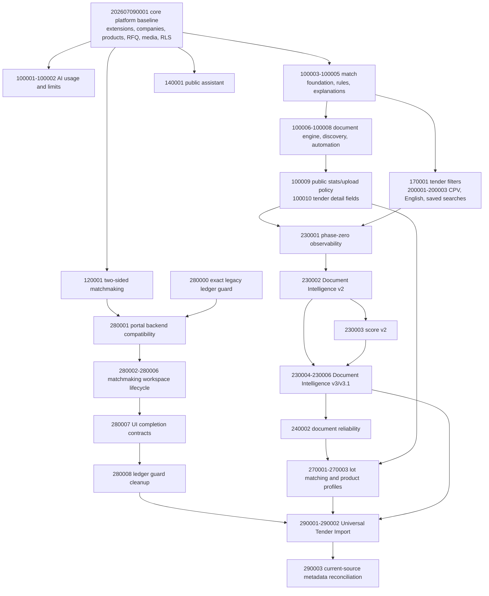

# MedicHall database baseline reconstruction

Date: 2026-07-29

Branch: `react-migration`

Starting commit: `eab79b23c44a3e4da033c22cf1e8b04edddb6dbd`

Production project: catalog inspection only

## Outcome

MedicHall now has an ordered, seed-free migration baseline. The complete
backend can be installed on an empty Supabase project with the migration CLI
alone. Root setup files, `supabase/setup/`, SQL editor snippets, live schema
copies, and manual repairs are not part of the installation path.

The reconstructed empty-project inventory is:

| Object class | Reconstructed | Production |
| --- | ---: | ---: |
| Public tables | 56 | 55 |
| Views/materialized views | 5 | 5 |
| Public functions/RPCs | 131 | 123 |
| Public indexes | 149 | 143 |
| Public foreign keys | 126 | 122 |
| Public/storage RLS policies | 92 | 86 |
| Non-internal public/storage triggers | 29 | 28 |
| RLS-enabled public tables | 56 | 55 |
| Storage buckets | 3 | 2 |
| Repository migration versions | 39 | 31 |

The deliberate difference is Universal Tender Import, whose two migrations
have not been deployed to production: one table, one private bucket, six
policies, one trigger, eight functions, six indexes, and four foreign keys.
Removing that not-yet-production module from the comparison leaves the
reconstructed structural counts aligned with production through
`202607280007`.

## Dependency graph

### Chronological dependency audit

| Version | Migration | Required predecessor / principal effect |
| --- | --- | --- |
| 202607090001 | core platform baseline | Empty Supabase system schemas; creates core marketplace, partner, company, buyer, RFQ, media, e-mail compatibility, grants and RLS |
| 202607100001 | AI usage | Core/auth; creates `medichall_ai_usage` |
| 202607100002 | secure AI limits | AI usage; limits, status contract and secure usage RPCs |
| 202607100003 | match engine foundation | Companies/products/admins; creates tenders, company profiles, distributors and opportunity matches |
| 202607100004 | match engine rules | Match foundation; deterministic normalization/scoring |
| 202607100005 | explainable match engine | Match foundation/rules; document-state and explainable score fields/RPCs |
| 202607100006 | tender document engine | Tenders/companies/explainability; document, job and evidence relations |
| 202607100007 | attachment discovery | Document engine; discovery jobs/RPCs |
| 202607100008 | tender automation | Discovery/document engine; archive jobs, cron, `tender-documents` bucket |
| 202607100009 | core runtime compatibility | Tender automation/core; public stats and authenticated upload policy |
| 202607100010 | tender detail compatibility | Tenders/opportunity matches; recovers `ai_lots` and `fit_narrative` |
| 202607120001 | two-sided matchmaking | Companies/auth; profiles, matches, connections, meetings |
| 202607140001 | public assistant | Core/tenders; public-assistant database contracts |
| 202607170001 | tender filters | Tenders; filter fields, FX and search RPC |
| 202607200001 | CPV catalog | Tenders; CPV reference/search |
| 202607200002 | English normalization | Tenders/matching; normalized English fields and scoring compatibility |
| 202607200003 | saved searches | Tender search/auth; saved searches and digest RPCs |
| 202607230001 | phase-zero observability | Companies/products/tender jobs; versions, traces, benchmark and access catalogs |
| 202607230002 | Document Intelligence v2 | Observability/document engine; v2 document and upload contracts |
| 202607230003 | match score v2 | Observability/matching/v2 extraction; v2 score relations/RPCs |
| 202607230004 | Document Intelligence v3 | V2 document engine; inspection/chunk schema and v3 RPCs |
| 202607230005 | v3 runtime compatibility | V3 pipeline-version records |
| 202607230006 | v3.1 performance | V3 jobs/chunks; cache, progress, metrics and v3.1 versions |
| 202607240002 | document reliability | V3.1 jobs/chunks; leases, stale recovery and cron |
| 202607270001 | lot-level matching | Products/tenders/evidence; lot-match table/RPCs |
| 202607270002 | lot grants | Lot matching; least-privilege grants |
| 202607270003 | product matching profile | Products/lot matching; structured product fields/RPCs |
| 202607280000 | UI ledger guard | Supabase migration ledger only; ignores one exact legacy self-registration marker |
| 202607280001 | portal backend compatibility | Core/two-sided matchmaking; portal RPC compatibility |
| 202607280002 | workspace schema | Matchmaking; proposals, events, messages, notes and follow-up schema |
| 202607280003 | workspace workflows | Workspace schema; idempotent connection/meeting lifecycle RPCs |
| 202607280004 | video and automation | Meeting lifecycle/Vault/cron; provider metadata and automation |
| 202607280005 | function privilege hardening | Workspace functions; least-privilege execution grants |
| 202607280006 | idempotency digest | Workspace idempotency; collision-resistant request digests |
| 202607280007 | UI completion | Workspace/RFQ; notification center, revision and rescheduling contracts |
| 202607280008 | ledger guard cleanup | UI completion; removes the temporary ledger trigger/function |
| 202607290001 | Universal Tender Import | Companies/tenders/document engine/matchmaking notifications/storage |
| 202607290002 | import hardening | Import v1/Vault/storage/document jobs; idempotency, validation and cleanup RPCs |
| 202607290003 | current-source metadata | Pipeline versions; records current source/test hashes without rewriting historical deployment manifests |

No circular relation, trigger, view, policy, or foreign-key dependency remains.
All 56 reconstructed public tables have RLS enabled.

## Missing-object and hidden-dependency recovery

| Hidden source | Missing migration contract | Resolution |
| --- | --- | --- |
| Root marketplace/setup scripts | `products`, `partners`, `admins`, `companies`, buyers, catalogs, RFQ, messages, offers, banners and AI logs | `202607090001` |
| Dashboard-only production changes | `company_certificates`; `companies.is_verified` | `202607090001` |
| Root privacy/e-mail scripts | `is_admin`, `company_is_public`, slug and RFQ notification functions/triggers; table/column grants and policies | `202607090001` |
| Root Storage setup | Public `media` bucket and policies | `202607090001` |
| `supabase/setup/PUBLIC-STATS.sql` | `medichall_public_stats()` | `202607100009` |
| `supabase/setup/DOKUMAN-YUKLEME.sql` | Authenticated `tender-documents/user-uploads/` insert policy | `202607100009` |
| `supabase/setup/DETAY-KURULUM.sql` | `tenders.ai_lots`; `opportunity_matches.fit_narrative` | `202607100010` |
| SQL-editor deployment marker in 280007 | Migration self-registers and collides with CLI ledger insert | Exact temporary guard in `280000`, removed by `280008`; deployed migration left unchanged |
| Undeployed 290002 | Unqualified `digest()` cannot resolve with its declared search paths | Three calls schema-qualified as `extensions.digest()` in the never-production-deployed migration |
| Historical observability manifests | Readiness checks compared superseded bundles to current source and the active root function tree retained three floating client imports | Historical evidence remains immutable; `repository-current.json`, `290003`, exact client pins and current JWT-policy checks describe reproducible source |
| Legacy e-mail setup file | Embedded provider credential and duplicate trigger source | Replaced with a non-executable deprecation notice; canonical migration reads Vault |

The core baseline is seed-free. It creates reference rows only where later
migrations themselves require deterministic catalogs. It does not create
admins, companies, users, products, tenders, messages, meetings, or customer
fixtures.

## Production reconciliation

Production was queried only through read-only catalog `SELECT` statements.
Production was not migrated, repaired, redeployed, or otherwise changed.

Confirmed production-only-before-reconstruction objects included:

- all original core marketplace/company/buyer/RFQ tables;
- `ai_usage_logs`, `company_certificates`, and `companies.is_verified`;
- the `media` bucket;
- public stats and tender upload policy;
- slug, privacy, admin and legacy notification helpers/triggers;
- `tenders.ai_lots` and `opportunity_matches.fit_narrative`.

Repository-only final objects are the two Universal Tender Import migrations
and the six corrective migration versions. Universal Tender Import remains
absent from production, as required. The corrective versions reproduce
existing production structure and do not imply that they were deployed there.

One intentional definition difference remains: the reconstructed
`notify_email` reads `medichall_resend_api_key` from Vault and safely returns
when absent. The historical production definition must be rotated and replaced
during a separately authorized production deployment. No provider or
service-role credential exists in browser files or the reconstructed migration.

## Installation and validation procedure

### Local

Use `supabase db reset`. Docker was unavailable on the validation workstation,
so the accepted documented remote command was used for the decisive proofs.

### Isolated staging

1. Create a brand-new project.
2. Copy `supabase/` to an access-controlled temporary directory.
3. Link only that temporary directory.
4. Run `supabase db push --include-all --dry-run`.
5. Run `supabase db push --include-all`.
6. Run `supabase db lint --linked --schema public,storage --fail-on error`.
7. Run all SQL regressions with `scripts/run-remote-sql-tests.ts`.
8. Deploy Edge Functions only to the isolated project and run contract smoke
   tests.
9. Delete the first accepted project, create another empty project, and repeat.

No manual SQL, setup file, seed, dump, or production copy is permitted.

### Production

Production deployment was out of scope. A future authorized deployment must:

1. confirm `react-migration` and a clean worktree;
2. capture a sanitized structural comparison and backup;
3. dry-run `supabase db push --include-all`;
4. review that only the corrective versions are pending;
5. rotate the historical e-mail credential and configure the Vault secret;
6. apply migrations in order, run SQL/security regressions, and only then
   deploy any separately approved Edge Function changes.

There is no production portal upload in this procedure.

### Rollback philosophy

Migrations are forward-only. Never rewrite a production-applied migration to
perform rollback. For an empty QA failure, delete the isolated project and
start again. For a future production fault, stop new writes, restore from the
approved database backup or ship a new corrective migration. Storage objects,
auth users, and customer rows require their own verified recovery plan; they
must not be deleted by a schema rollback.

## Regression evidence

| Check | Result |
| --- | --- |
| Complete SQL migration chain | Passed on disposable QA after discovery fixes |
| Database lint | 0 errors; public recovery RPC warning covered by a passing runtime assertion; Supabase-owned Storage dynamic-SQL warnings remain |
| SQL regressions | 11/11 passed, transactionally rolled back |
| Deno Edge tests | 111/111 passed |
| Configured and supplemental Edge entrypoint type-check | 12/12 passed from isolated lockfile copy |
| React/Vitest | 16 files, 95/95 passed |
| React TypeScript | Passed |
| React ESLint | Passed |
| React production build | Passed; 1,850 modules |
| Portal JavaScript/static IDs | 2 scripts parsed; 220 unique static IDs |
| Working-tree secret scan | 330 text files; no credential literals |
| Edge deployment contract | 12 isolated deployments; every unauthenticated POST returned 401 |
| Application smoke | Auth, company, product, marketplace, RFQ, messages, connection, meeting proposal, notifications, workspace, tender search and public stats passed |
| QA portal artifact | HTTPS fetch/parse passed; QA-bound; production ref absent |
| Repository readiness/current-source hashes | Passed with 39 unique migrations and all 12 current function sources/policies verified |
| `git diff --check` | Passed during development; rerun before commit |

Discovery attempts found and fixed two deterministic blockers:

- 23.951 seconds: duplicate migration-ledger key at `202607280007`;
- 22.420 seconds: unresolved `digest()` in `202607290002`.

The final two clean-install timings and commit identifiers are appended after
the committed acceptance runs.

## Remaining technical debt

- Production still needs a separately authorized credential rotation and
  Vault-backed e-mail function migration.
- Root/setup SQL files remain for forensic history. They are noncanonical and
  should eventually move to a clearly marked archive; deleting history was not
  required for reproducibility.
- The broad exploratory Deno formatter/linter reports historical style/import
  findings in duplicate legacy function trees, and the checked-in Deno lock
  lacks one alias entry. Canonical configured entrypoints type-check from an
  isolated refreshed lock, and all 111 behavioral tests pass.
- The in-app browser client blocks direct navigation to Supabase project
  Storage URLs. The isolated portal was therefore verified by HTTPS
  fetch/parse plus authenticated API smoke coverage.
