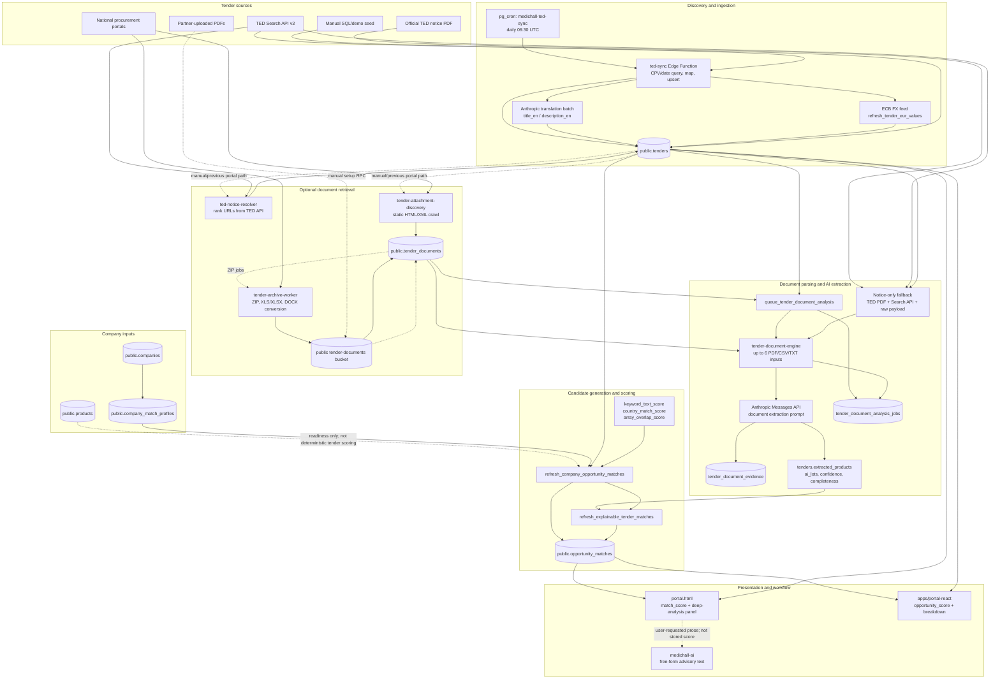

# MedicHall matching-engine data flow

This diagram is based on the repository implementation on `react-migration` at
commit `735b8eaa44723c5d0d7507fe9bea153a4df23db0`. It describes code paths, not an
assumption that every manually installed SQL patch is present in production.

## Important runtime distinction

The current `portal.html` function `deepAnalyze` does **not** invoke
`ted-notice-resolver`, `tender-attachment-discovery`, or
`tender-archive-worker`. It queues `tender-document-engine` directly. The
resolver/crawler/archive path exists in the repository and is described in
older automation documentation, but the active click path intentionally calls
the engine first and falls back to the TED notice when no registered supported
document is available.

This distinction is central to the reported failure mode: a procurement page
can contain an openly downloadable specification while the active application
never crawls that page.

## Persisted boundaries

| Boundary | Persisted data | Current consumer |
|---|---|---|
| TED ingestion | `tenders`, `raw_payload`, translation fields, normalized CPV/value fields | search, base matcher, document fallback |
| Retrieval | `tender_documents`, discovery/archive job tables, storage objects | document analysis queue |
| Extraction | tender-level extracted products/lots/status plus job-scoped evidence | explainable refresh and legacy deep-analysis panel |
| Company profile | company row and `company_match_profiles` | base matcher; partial company context in Claude prompt |
| Matching | `opportunity_matches` base, explainable, confidence, reason, risk, and workflow fields | legacy and React portals |

## Non-implemented arrows

The repository contains no production path for:

- embeddings or vector similarity;
- synonym dictionaries, stemming, or medical terminology normalization;
- deterministic comparison of `public.products` to extracted tender products;
- OCR orchestration or an image parser;
- event-triggered rescoring on company/profile/product changes;
- event-triggered document discovery during TED ingestion;
- deterministic validation that an AI evidence quote occurs in the source
  document.

Those omissions are intentionally shown as absent rather than inferred.
