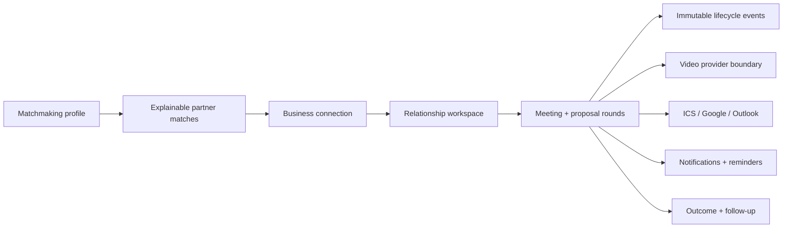

# MedicHall Matchmaking Workspace Architecture

**Date:** 2026-07-28
**Branch:** `react-migration`
**Production frontend:** root `portal.html`
**Supabase project:** `azdmuarzntzqdyirysux`

## Architecture diagnosis

The production compatibility audit at source HEAD
`d69b384056fd24422f15f414274203012857a149` established that every table,
relationship, RPC, policy, and Edge Function used by the existing portal is
present and callable in production. The new workspace therefore extends the
existing two-sided model:

1. `matchmaking_profiles`;
2. `matchmaking_matches`;
3. `business_connections`; and
4. `matchmaking_meeting_requests`.

It does not create a competing match engine or relationship system.

The root `portal.html` remains the canonical production integration point.
`matchmaking.html` is a legacy prototype. `apps/portal-react` remains an
incremental migration target and provides regression-test infrastructure, but
it is not a second production workspace.

The prior meeting model had one proposed time and the statuses `pending`,
`accepted`, `declined`, `cancelled`, and `completed`. It did not have a meeting
response RPC, proposal history, optimistic locking, an event log, reminders,
calendar output, a provider boundary, messaging outside RFQs, or a
post-meeting workflow.

`rfq_messages` remains RFQ-specific. Matchmaking messages are connection-scoped
and cannot be read by an unrelated RFQ participant.

## Canonical data flow



Portal reads use participant-filtered workspace/detail RPCs. Portal mutations
use narrow RPCs. The provider Edge Function validates the user JWT, calls a
rate-limited participant authorization RPC with the caller's JWT, and uses the
service role only for provider metadata transitions.

Provider API credentials and the Supabase service-role key never enter browser
files. Provider join tokens are generated only at join time, returned with
`Cache-Control: no-store`, kept in runtime memory, and removed when the video
iframe closes.

## Meeting state machine

| Current state | Permitted transition | Authority |
|---|---|---|
| `draft` | `proposed`, `cancelled` | creator |
| `proposed` | `awaiting_response`, `accepted`, `counter_proposed`, `declined`, `cancelled`, `expired` | recipient / backend |
| `awaiting_response` | `accepted`, `counter_proposed`, `declined`, `cancelled`, `expired` | current responder / backend |
| `counter_proposed` | `awaiting_response`, `accepted`, `counter_proposed`, `declined`, `cancelled`, `expired` | current responder / backend |
| `accepted` | `confirmed`, `cancelled` | provider backend / participants |
| `confirmed` | `completed`, `no_show`, `cancelled` | participants |
| `declined` | terminal | — |
| `cancelled` | terminal | — |
| `completed` | outcome/follow-up only | participants |
| `no_show` | outcome/follow-up only | participants |
| `expired` | terminal | backend automation |

The recipient's first open changes `proposed` or `counter_proposed` to
`awaiting_response`, removing the old ambiguous `pending` presentation.

Each proposal round contains exactly three immutable UTC slots and the IANA
timezone in which they were entered. A counter-proposal supersedes but does not
delete the prior round.

Acceptance:

1. locks the meeting row;
2. checks `state_version`;
3. verifies that the selected proposal is active in the current round;
4. prevents the proposer from accepting their own slot;
5. marks the chosen slot accepted and the other slots superseded;
6. advances the meeting to `accepted`;
7. adds the event, system message, participant responses, and notification in
   one transaction; and
8. records the idempotent response for safe retry.

Stale or double responses fail with SQLSTATE `40001`.

## Schema additions

The migrations add:

- structured match explanations, including weights, weighted component points,
  confidence limitations, and risk signals;
- meeting proposal rounds and participants;
- immutable meeting events;
- connection-scoped human and system messages;
- per-profile private relationship/meeting notes;
- shared meeting outcomes and follow-up times;
- in-app notifications and deduplicated reminders;
- idempotency records;
- provider room metadata (never provider credentials or join tokens); and
- a rate-limit access log for video actions.

The existing meeting table is extended in place. Legacy `pending` meetings are
backfilled to `proposed`; legacy single times become proposal round 1; legacy
participants and an import event are backfilled.

## Tenant and security model

- RLS remains enabled on the four existing matchmaking tables and is enabled
  on every new table.
- Direct authenticated inserts, updates, and deletes are revoked on lifecycle,
  proposal, event, notification, message, notes, outcome, reminder,
  idempotency, and provider-access tables.
- Security-definer functions use fixed `search_path` values.
- Read RPCs select only the current profile's matches and relationships.
- Draft meetings are visible only to their creator.
- Shared meeting data is visible only to the two relationship profiles.
- Private notes are selected only for their owner profile, including inside
  the detail RPC.
- Provider claim/complete/failure/revocation and automation RPCs are executable
  only by `service_role`.
- Anonymous execution is revoked from every workspace RPC.
- Audit-event update/delete is rejected by a trigger.
- Video actions are limited per profile, meeting, action, and five-minute
  window.

The current production account model has one matchmaking profile per
authenticated user and at most one profile per `companies` row. The participant
schema supports future roster work, but this implementation does not invent
company members who do not exist in the current source of truth.

## Video provider evaluation and decision

Daily is the selected managed provider, behind the
`MeetingVideoProvider` interface.

| Option | Fit | Decision |
|---|---|---|
| Daily | Private expiring rooms, room-scoped expiring tokens, prebuilt embedded UI, screen sharing, recording disabled by default, current free allowance | Selected |
| Whereby Embedded | Strong prebuilt embed and screen sharing; smaller current free allowance and a paid base tier for ongoing usage | Supported by the abstraction later |
| Twilio Video | Fine-grained programmable rooms and room-scoped access tokens, but a substantially larger custom client/server surface | Not selected for this increment |
| Agora | Capable SDK platform, but requires more client UI and token-server work than the current portal needs | Not selected |
| Jitsi | Good open-source embed; a production private deployment requires operating secured infrastructure or buying JaaS | Not selected |

Official source basis:

- Daily private rooms can use `nbf`/`exp`, and Daily recommends room expiration:
  [Daily room API](https://docs.daily.co/reference/rest-api/rooms/create-room).
- Daily tokens can be room-scoped and have `nbf`/`exp` and ejection controls:
  [Daily meeting-token API](https://docs.daily.co/reference/rest-api/meeting-tokens/create-meeting-token).
- Daily states that API-created rooms have recording disabled by default and
  media is not stored unless recording is explicitly enabled:
  [Daily data protection](https://www.daily.co/security/data-protection/).
- Daily currently includes 10,000 free participant minutes per month:
  [Daily Video pricing](https://www.daily.co/pricing/video-sdk/).
- Whereby currently lists 2,000 free participant minutes and a paid Build tier:
  [Whereby Embedded pricing](https://whereby.com/information/embedded/pricing).
- Twilio access tokens are short-lived server-generated JWTs and can be scoped
  to one room:
  [Twilio Video access tokens](https://www.twilio.com/docs/video/tutorials/user-identity-access-tokens).
- Jitsi's iframe API supports public Jitsi, self-hosted servers, and JWT input:
  [Jitsi iframe API](https://jitsi.github.io/handbook/docs/dev-guide/dev-guide-iframe/).

Daily rooms are private, available from 15 minutes before the meeting until one
hour after its end, capped to the known participant count (with a safe upper
bound), and configured without recording. Daily chat is disabled because
MedicHall retains the auditable relationship conversation.

Required Edge Function secrets:

```text
MEETING_VIDEO_PROVIDER=daily
DAILY_API_KEY=<managed Edge Function secret>
```

Optional:

```text
DAILY_API_BASE_URL=https://api.daily.co/v1
```

If `DAILY_API_KEY` is absent, the Edge Function confirms the accepted meeting
with `video_status=unconfigured`. It returns an explicit configuration-disabled
response. Calendar, timeline, notifications, cancellation, completion, notes,
and outcomes remain operational. No provider room or fake join credential is
claimed.

## Calendar and notification behavior

All instants are stored as `timestamptz`/UTC. Proposal rows retain the creator's
IANA timezone. The portal displays times in the current viewer's IANA timezone.

Confirmed meetings provide:

- an RFC 5545-shaped ICS download;
- a Google Calendar compose URL;
- an Outlook Calendar compose URL; and
- a token-free deep link to the authenticated MedicHall meeting workspace.

Google/Microsoft calendar write-back is not claimed because the repository has
no calendar OAuth application or refresh-token lifecycle.

Backend automation runs every five minutes when `pg_cron` is available. It:

- expires proposal rounds with no viable future slot;
- delivers deduplicated in-app reminders;
- creates post-meeting follow-up prompts; and
- removes expired idempotency/rate-limit records.

The migration leaves the automation RPC callable by service role if `pg_cron`
is unavailable.

The legacy database email sender is not extended. Email reminder records are
failed with `email_provider_unconfigured` rather than claiming delivery until
email credentials are rotated into managed secret storage.

## Rollout and rollback

Apply in order:

1. `202607280002_matchmaking_workspace_schema.sql`;
2. `202607280003_matchmaking_workspace_workflows.sql`;
3. `202607280004_matchmaking_video_and_automation.sql`;
4. `202607280005_matchmaking_function_privilege_hardening.sql`;
5. `202607280006_matchmaking_idempotency_digest.sql`;
6. deploy `meeting-video`; and
7. deploy the complete root `portal.html`.

The migrations are additive except for widening the meeting status constraint
and replacing the three legacy matchmaking RPC bodies with compatible wrappers.
The old signatures remain callable.

Application rollback is the prior complete `portal.html`. Edge rollback is
undeploying `meeting-video` or setting `MEETING_VIDEO_PROVIDER=disabled`.
Database rollback is forward-only: stop the portal/Edge rollout, preserve
events, and use a corrective migration. Destructive table drops are not part of
the production rollback plan.
